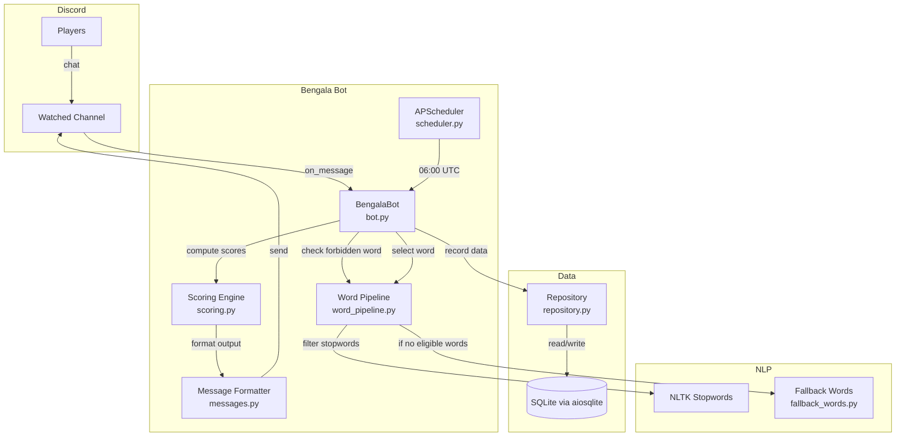
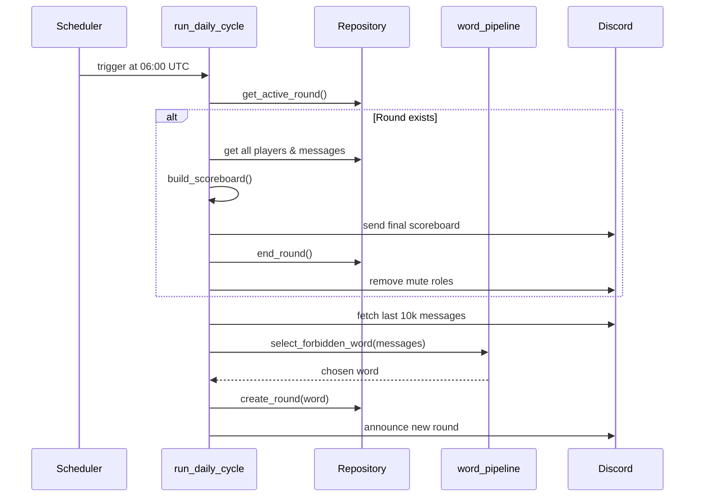
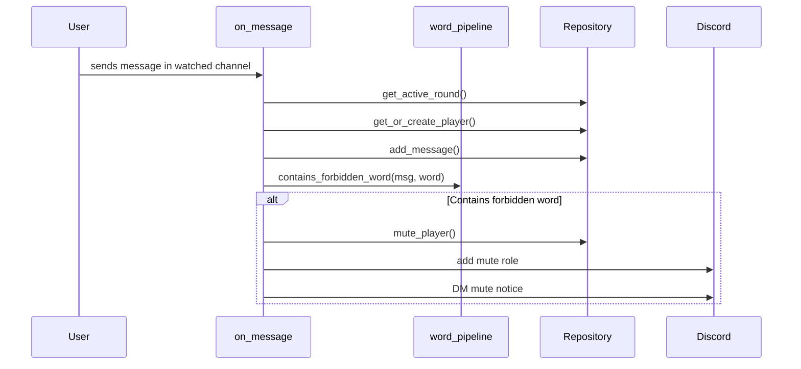

# Codebase Map

> Auto-generated by Cartographer. Last mapped: 2026-03-20

## System Overview

Bengala is a Portuguese-language Discord bot that runs a daily "forbidden word" game. Each day at 06:00 UTC, a secret word is selected from recent channel messages. Players who say the forbidden word get silenced (muted) for the rest of the round. Scoring is based on unique words (4+ chars, stop-words removed) each player sends.



## Directory Structure

```
roleta/
├── bengala/                  # Main application package
│   ├── __init__.py
│   ├── __main__.py           # Entry point - wires DI, runs bot
│   ├── bot.py                # Discord bot class, event handlers, slash commands
│   ├── config.py             # Environment variable loading & validation
│   ├── fallback_words.py     # 200+ hardcoded Portuguese fallback words
│   ├── messages.py           # All user-facing Portuguese message templates
│   ├── models.py             # Domain dataclasses (RoundData, PlayerData, etc.)
│   ├── scheduler.py          # APScheduler setup for daily cycle
│   ├── scoring.py            # Score calculation & scoreboard building
│   ├── word_pipeline.py      # NLP: tokenization, filtering, word selection
│   └── db/
│       ├── __init__.py
│       ├── repository.py     # Async SQLite data access layer
│       └── schema.py         # DDL schema & init_db()
├── tests/                    # Test suite (pytest + pytest-asyncio)
│   ├── __init__.py
│   ├── conftest.py           # Shared fixtures (in-memory DB, repo)
│   ├── test_bot.py
│   ├── test_config.py
│   ├── test_fallback_words.py
│   ├── test_messages.py
│   ├── test_repository.py
│   ├── test_scheduler.py
│   ├── test_scoring.py
│   └── test_word_pipeline.py
├── docs/
│   └── CODEBASE_MAP.md       # This file
├── Dockerfile                # Multi-stage production build
├── docker-compose.yml        # Single-service compose config
├── pyproject.toml            # Project metadata, deps, tool config
├── requirements.txt          # Runtime dependencies
├── requirements-dev.txt      # Dev/test dependencies
├── .env.example              # Environment variable template
├── completion.md             # Original design specification (Portuguese)
└── README.md                 # Operational documentation (Portuguese)
```

## Module Guide

### `bengala/bot.py` (core)

**Purpose**: Discord bot class, event handlers, slash commands, and daily cycle orchestration.
**Entry point**: Instantiated in `__main__.py`
**Key exports**: `BengalaBot` (class), `run_daily_cycle` (async function)

| Dependency | Role |
|-----------|------|
| config.py | Bot configuration (token, channel, roles) |
| db/repository.py | All data persistence |
| messages.py | All Discord-visible message formatting |
| scoring.py | Score calculation for scoreboards |
| word_pipeline.py | Forbidden word selection & detection |

**Slash commands**: `/rules`, `/placar`, `/secret` (admin), `/restart` (admin), `/reroll` (admin)

**Gotchas**:
- Easter egg: messages containing `"padi"` trigger a DM taunt (hardcoded)
- `_compute_scoreboard` is defined but never called (dead code)
- Fetches up to 10,000 messages from channel history for word selection

### `bengala/word_pipeline.py` (NLP)

**Purpose**: Tokenize messages, filter stop words, select forbidden word, detect forbidden word.
**Key exports**: `tokenize_message()`, `filter_tokens()`, `select_forbidden_word()`, `contains_forbidden_word()`

**Key behavior**:
- Words must have 4+ chars, appear 5+ times, and have 3+ distinct characters to be eligible
- NLTK stop words cached at module level after first load
- Falls back to `FALLBACK_WORDS` if no eligible words found
- `_strip_accents()` exists but is never called (dead code)

### `bengala/db/repository.py` (data layer)

**Purpose**: Async data access layer wrapping all SQLite operations.
**Key exports**: `Repository` (class)

**Key behavior**:
- Every mutation commits immediately (no batching)
- `_parse_dt` defensively adds UTC to naive datetimes
- `get_active_round` returns most recent active round only
- Foreign keys declared in schema but **not enforced** (`PRAGMA foreign_keys = ON` never set)

### `bengala/scoring.py` (business logic)

**Purpose**: Pure functions for score calculation and scoreboard building.
**Key exports**: `calculate_player_score()`, `build_scoreboard()`

**Key behavior**:
- Score = count of unique words (4+ chars, not stop words) across all messages
- Muted players: only messages sent strictly before `muted_at` count
- Scoreboard sorted descending by score

### `bengala/messages.py` (presentation)

**Purpose**: All user-facing Portuguese string templates.
**Key exports**: `format_final_scoreboard()`, `format_partial_scoreboard()`, `format_rules()`, `format_mute_notice()`, `format_secret_word()`, etc.

**Key behavior**:
- Partial scoreboard intentionally hides mute status (privacy during round)
- Final scoreboard reveals mute status

### `bengala/config.py`

**Purpose**: Load and validate four required env vars into frozen `Config` dataclass.
**Required vars**: `DISCORD_TOKEN`, `CHANNEL_ID`, `MUTE_ROLE_ID`, `ADMIN_ROLE_ID`
**Optional**: `BENGALA_DB_PATH` (used in `__main__.py`, defaults to `data/bengala.db`)

### `bengala/models.py`

**Purpose**: Domain dataclasses: `RoundData`, `PlayerData`, `MessageData`, `PlayerScore`
**Note**: `RoundState` is defined but unused (dead code)

### `bengala/scheduler.py`

**Purpose**: Creates APScheduler `AsyncIOScheduler` with daily job at 06:00 UTC.
**Note**: Lazy import of `run_daily_cycle` to avoid circular imports.

## Data Flow

### Daily Cycle (06:00 UTC)



### Message Processing



## Conventions

- **Language**: All user-facing strings in Brazilian Portuguese; code in English
- **Type safety**: `mypy --strict` throughout; `type: ignore` for untyped Discord library calls
- **Async**: `aiosqlite` + `discord.py` async API + `AsyncIOScheduler` — no blocking I/O
- **State**: No in-memory game state — everything persisted to SQLite immediately (crash-safe)
- **Pure functions**: `scoring.py`, `word_pipeline.py`, `messages.py` have no side effects
- **Annotations**: `from __future__ import annotations` in every module
- **Datetimes**: Always `timezone.utc`-aware; stored as ISO 8601 text in SQLite
- **Testing**: `asyncio_mode = "auto"` in pytest; in-memory SQLite for repo tests

## Gotchas

1. **Foreign keys not enforced** — Schema declares FK references but `PRAGMA foreign_keys = ON` is never set
2. **Dead code** — `_compute_scoreboard` (bot.py), `RoundState` (models.py), `_strip_accents` (word_pipeline.py)
3. **`/reroll` undocumented** — Implemented in bot.py but missing from README.md
4. **`BENGALA_DB_PATH` undocumented** — Used in `__main__.py` but not in `.env.example`
5. **Docker healthcheck** — Only verifies Python interpreter, not bot connectivity
6. **`padi` easter egg** — Hardcoded DM taunt, not configurable
7. **`setup_hook` monkey-patch** — `__main__.py` replaces `bot.setup_hook` dynamically for scheduler injection

## Navigation Guide

**To add a new slash command**: `bengala/bot.py` — define function with `@app_commands.command`, register in `setup_hook`
**To change game rules**: `bengala/word_pipeline.py` (word selection), `bengala/scoring.py` (scoring logic)
**To modify messages**: `bengala/messages.py` — all user-facing strings centralized here
**To add a DB table/column**: `bengala/db/schema.py` (DDL), `bengala/db/repository.py` (queries), `bengala/models.py` (dataclass)
**To change the schedule**: `bengala/scheduler.py` — modify `CronTrigger` params
**To add a new domain model**: `bengala/models.py`
**To write tests**: `tests/` — use `conftest.py` fixtures for DB-backed tests, `MagicMock`/`AsyncMock` for Discord
